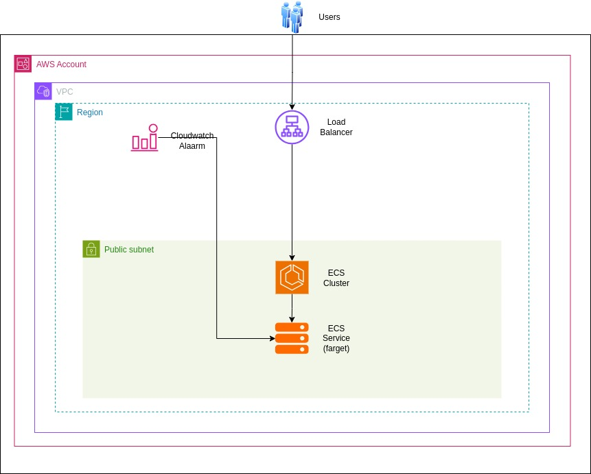

# Terraform Infrastructure Deployment

## Prerequisites

1. Run the following command to create an SSH key. This SSH key will be used in the user data launch template of the Auto Scaling Group:
   
   ```sh
   ssh-keygen -t rsa
   ```

2. Clone the following Git repository and navigate to that repository:

    ```sh
    git clone https://github.com/DhyeyB/vebuin-infra-demo.git
    cd vebuin-infra-demo
    ```

## Steps to Deploy the Infrastructure

### 1. Create `terraform.tfvars` File
Create a `terraform.tfvars` file and add all the variables mentioned in the `example.tfvars` file available in the GitHub repository.

**Note:** Use the SSH public key we created earlier in the `terraform.tfvars` file.

### 2. Initialize Terraform
Run the following command to initialize the Terraform working directory:

```sh
terraform init
```

### 3. Plan the Deployment
Execute the following command to preview the changes before applying them:

```sh
terraform plan
```

### 4. Apply the Deployment
Deploy the infrastructure by running:

```sh
terraform apply -auto-approve
```

### 5. Destroy the Infrastructure (If Needed)
To tear down the infrastructure, use:

```sh
terraform destroy -auto-approve
```

# Testing Load and Auto Scaling

To test the auto scaling setup and verify that instances are scaled up based on CPU usage, follow these steps:

### 1. Login to EC2 Instance

First, you need to SSH into EC2 instances using the private key you created earlier. Use the following command to log in:

```bash
ssh -i /path/to/your/private-key.pem ubuntu@<IP Address>
```

### 2. Bash Script to Simulate High CPU Usage

Once you are logged into the EC2 instance, you can create a simple bash script to increase the CPU usage. This will trigger the auto scaling policy based on CPU utilization.

```bash
nano cpu_stress.sh
```

```bash
#!/bin/bash

# Loop to simulate high CPU usage
echo "Starting CPU stress test..."
while true; do
  # Perform calculations to keep the CPU busy
  echo "scale=5000; 4*a(1)" | bc -l > /dev/null
done
```

Save and close the file by pressing Ctrl + X, then Y to confirm, and Enter to save.

### 3. Run the Script

To start the CPU stress test and increase the CPU usage, run the script with the following command:

```bash
chmod +x cpu_stress.sh
./cpu_stress.sh
```

This will continuously run the calculations, and the CPU usage should spike, triggering the CloudWatch alarm and causing the Auto Scaling Group to scale up the instances.

### 4. Monitor the Auto Scaling Behavior

You can check CPU usage in cloud watch alarm. After sometime CPU usage will be high and ASG will launch new instance. And when you will stop the script then after CPU usage will be down and ASG will terminate the instance.

# Architecture Overview

The architecture I have designed leverages AWS services to make the application accessible over the internet while ensuring automatic scaling based on resource usage (CPU and memory). The setup is fully provisioned and managed using Infrastructure as Code (IaC) with Terraform.

## Services Used:

1. **VPC (Virtual Private Cloud)**:
   - The application is deployed inside a VPC to provide network isolation.

2. **Security Groups**:
   - Security Groups are used to define inbound and outbound traffic rules for the application.

3. **Elastic Load Balancer (ALB)**:
   - The Application Load Balancer (ALB) is used to distribute incoming traffic evenly across the EC2 instances.
   - It exposes the application to the internet and routes traffic based on predefined rules.
   
4. **Auto Scaling Group (ASG)**:
   - The Auto Scaling Group ensures that the application scales horizontally based on resource usage.
   - EC2 instances are added or removed from the Auto Scaling Group depending on CPU and memory usage.

5. **CloudWatch Alarms**:
   - CloudWatch is used to monitor the resource usage (CPU or memory) of EC2 instances.
   - Alarms are set to trigger when CPU usage exceeds a predefined threshold, prompting the Auto Scaling Group to scale out (add instances).
   - Similarly, when CPU usage drops below a certain threshold, the scaling policy will scale in (remove instances).



## Reasoning Behind the Approach

In this architecture, I have considered **Nginx** as the application server to demonstrate the scalability and availability of the setup. Here's the reasoning behind the approach:

1. **Nginx as the Application**:
   - I have chosen **Nginx** as the application, which is commonly used as a reverse proxy and web server. The DNS hostname of the **Application Load Balancer (ALB)** will be used to expose the application over the internet. 
   - When a user accesses the ALB's DNS hostname, it will route the request to one of the EC2 instances, which will display the Nginx default page. This confirms that the application (in this case, Nginx) is live and accessible over the internet.
   - Behind the scenes, **Nginx** is configured as a reverse proxy, which means that it will forward incoming traffic to the appropriate service (or port). This setup ensures that the traffic is efficiently distributed.

2. **Auto Scaling (ASG) and CloudWatch Metrics for Scalability**:
   - To handle varying levels of traffic and resource usage, I have implemented an **Auto Scaling Group (ASG)**. The ASG allows the application to scale automatically based on CPU and memory usage.
   - I used **CloudWatch** to monitor the EC2 instance metrics, specifically **CPU usage**. When CPU usage exceeds a defined threshold (e.g., 80%), a CloudWatch Alarm is triggered to scale up the instances. This ensures that when the application is under heavy load, additional EC2 instances are provisioned to handle the increased traffic.
   - On the other hand, when CPU usage drops below the threshold, the Auto Scaling policy triggers a scale-down event, reducing the number of instances. This helps in cost optimization by ensuring that no unnecessary resources are running during low traffic periods.

3. **Elastic Load Balancer (ALB) for High Availability**:
   - The **ALB** is used to distribute traffic evenly among the EC2 instances, ensuring that the application can handle high availability and fault tolerance. If one instance becomes unhealthy or is scaled down, the ALB automatically routes the traffic to other healthy instances, ensuring uninterrupted service.

This approach ensures that the application is highly available, can scale based on demand. By using CloudWatch metrics and Auto Scaling, we ensure that the system adapts to changing traffic patterns automatically, optimizing resource usage and minimizing costs.